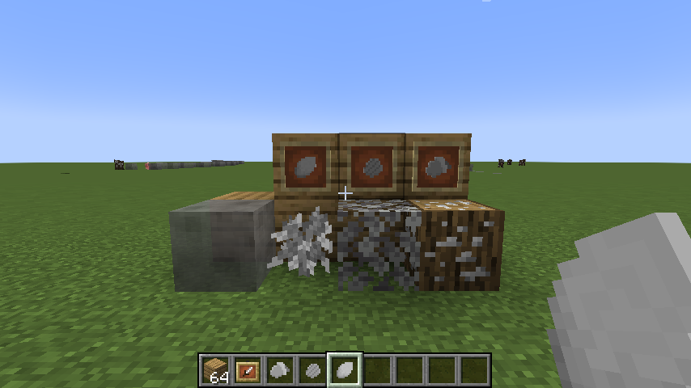

## 3.1.0-alpha
- All blocks can be generated now
## 3.0.0-alpha

- Added almost all the template items, which include
- Template Ore Log
- Template Ore Leaves
- Template Amber
- Template Resin
- Template Acorn
- Template Roasted Acorn
- Added a creative mode tab for the template items
- Refactored more code (especially in the file writing area)
## 2.1.0-alpha
- Sapling models and blockstates are now autogenerated into a texture pack
- Removed "evil" from default ore types
- Did some more code refactoring
## 2.0.0-alpha
- Saplings can now be added through a .toml file
- Also added some utility stuff to the mod's backend to make my life easier
## 1.0.0-alpha
- Added block generation